# Project Name  :   Peak Performance

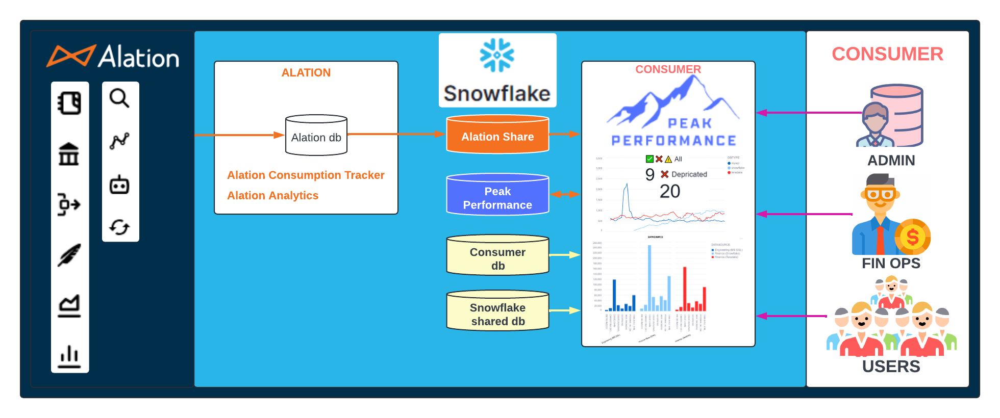

Peak Performance is a powerful solution that delivers numerous benefits to Snowflake customers. It facilitates maximum adoption growth and data maturity, ensuring complete enterprise visibility across the health, cost, and performance of their Snowflake Data Cloud. By leveraging Peak Performance, organizations can gain immediate data intelligence across their entire enterprise data estate. This enables visibility across every connected data source and database, allowing businesses to analyze patterns, optimize operations, and data-driven business growth. With this enhanced visibility, organizations can optimize their investment in Snowflake and extract the maximum value from their data.

•	Get Started Today:
Unlock your Snowflake Data Cloud's full potential and transform how your organization manages, analyzes, and optimizes data with Peak Performance. Our comprehensive solution empowers businesses with unmatched visibility and intelligence across their entire data landscape, ensuring efficient data management, governance, and enhanced decision-making capabilities.


## Table of Contents

- [Installation](#installation)
- [Pre-requisite](#Pre-requisite-for-Alation-Customers)
- [SETUP SQL](#SETUP-SQL)
	- [script1](#script1)
	- [script2](#script2)
	- [script3](#script3)
	- [script4](#script4)- 
- [Usage](#usage)
	- [PEAK PERFORMANCE SITE MAP](#PEAK-PERFORMANCE-SITE-MAP)
	 	- [Snowflake](#Snowflake)
	 	- [Alation Consumption Tracker](#Alation-Consumption-Tracker)
	 	- [Alation Analytics](#Alation-Analytics)

  	- [Peak Performance Header Control](#Peak-Performance-Header-Control)
 		- [Source Category](#Source-Category)
 		- [Report  Category](#Report-Category)
 		- [Sub Category](#Sub-Category)
 		- [Date From - To](#date-From---To)
 		- [Database Type](#Database-Type)
 		- [Users](#Users)

## Installation											-[Back](#Table-of-Contents)

•	Navigate to Data Products --> Market Place

•	Search for Peak Performance  --> Click On "Get"

•	Follow Pre-requisite for Alation

•	Execute SQL Script to grant access to Application to access Consumer Database
- [script1](#script1)
	Grant Access privilages to Snowflake Database
- [script2](#script2)
	Set up Alation Consumption Tracker Objects
- [script3](#script3)
	Set up Alation Analytics Objects
- [script4](#script4)
	Set up Alation consumption tracker Objects


## Pre-requisite for Alation Customers
- [Back](#Table-of-Contents)
•	Trigger the Alation Replication to Snowflake

•	Initiate a Support Ticket to request Alation Consumption Tracker and Alation Analytics Data share from Snowflake instance owned by Alation

•	Follow the Instructions to get the privately shared database from Alationa name the database AlationaACTAA ( Feel free to use your naming convention as per your organization Standards) 
	This database name will be required to be updated in the SQl Script below if named different than "ALATIONACTAA"


## SETUP SQL
- [Back](#Table-of-Contents)

## script1
- [Back](#Table-of-Contents)

```sql
--###############   Setup references to objects related to  Alation Consumption Tracker  START   ###############--

```

## script2
- [Back](#Table-of-Contents)
Setup references to objects related to Alation Consumption Tracker  START


```sql


SET dbname = 'ALATIONACTAA';
SET schemaAct = 'ACT';

SET appSchema = 'USE SCHEMA CODE_SCHEMA';
EXECUTE IMMEDIATE $appSchema;
 
--###############   Setup references to objects related to  Alation Consumption Tracker  START   ###############--
SET tbl = 'QLI_EVENTS';
CALL UPDATE_REFERENCE(
$tbl , 'ADD', SYSTEM$REFERENCE('TABLE', $dbname || '.' || $schemaAct || '.' || $tbl, 'PERSISTENT', 'SELECT'));

SET tbl = 'FLAGS';
CALL UPDATE_REFERENCE(
$tbl , 'ADD', SYSTEM$REFERENCE('TABLE', $dbname || '.' || $schemaAct || '.' || $tbl, 'PERSISTENT', 'SELECT'));

SET tbl = 'RDBMS_DATASOURCES';
CALL UPDATE_REFERENCE(
    $tbl , 'ADD', SYSTEM$REFERENCE('TABLE', $dbname || '.' || $schemaAct || '.' || $tbl, 'PERSISTENT', 'SELECT'));

SET tbl = 'RDBMS_TABLES';
CALL UPDATE_REFERENCE(
    $tbl , 'ADD', SYSTEM$REFERENCE('TABLE', $dbname || '.' || $schemaAct || '.' || $tbl, 'PERSISTENT', 'SELECT'));

SET tbl = 'EVENT_TABLE_MAPPING';
CALL UPDATE_REFERENCE(
    $tbl , 'ADD', SYSTEM$REFERENCE('TABLE', $dbname || '.' || $schemaAct || '.' || $tbl, 'PERSISTENT', 'SELECT'));

SET tbl = 'QLIEVENTSVIEW';
CALL UPDATE_REFERENCE(
    'QLIEVENTSVIEW' , 'ADD', SYSTEM$REFERENCE('VIEW', $dbname || '.' || $schemaAct || '.' || $tbl, 'PERSISTENT', 'SELECT'));

--###############   Setup references to objects related to  Alation Consumption Tracker  END   ###############--
```

## script3
- [Back](#Table-of-Contents)
Setup references to objects related to Alation Analytics  START

```sql
--###############        Setup references to objects related to Alation Analytics  START       ###############--

SET appName = 'PEAKPERFORMANCE';
SET dbname = 'ALATIONACTAA';
SET appSchema = 'USE SCHEMA CODE_SCHEMA';
EXECUTE IMMEDIATE $appSchema;

SET schemaAA = 'ANALYTICS';

SET tbl = 'RDBMS_DATASOURCES';
CALL UPDATE_REFERENCE(
'AA_RDBMS_DATASOURCES' , 'ADD', SYSTEM$REFERENCE('TABLE', $dbname || '.' || $schemaAA || '.' || $tbl, 'PERSISTENT', 'SELECT'));
  
SET tbl = 'RDBMS_TABLES';
CALL UPDATE_REFERENCE(
'AA_RDBMS_TABLES' , 'ADD', SYSTEM$REFERENCE('TABLE', $dbname || '.' || $schemaAA || '.' || $tbl, 'PERSISTENT', 'SELECT'));
  
SET tbl = 'ALATION_GROUP';
CALL UPDATE_REFERENCE(
$tbl , 'ADD', SYSTEM$REFERENCE('TABLE', $dbname || '.' || $schemaAA || '.' || $tbl, 'PERSISTENT', 'SELECT'));
  
SET tbl = 'ALATION_SET_MEMBER';
CALL UPDATE_REFERENCE(
$tbl , 'ADD', SYSTEM$REFERENCE('TABLE', $dbname || '.' || $schemaAA || '.' || $tbl, 'PERSISTENT', 'SELECT'));
  
SET tbl = 'ARTICLE';
CALL UPDATE_REFERENCE(
$tbl , 'ADD', SYSTEM$REFERENCE('TABLE', $dbname || '.' || $schemaAA || '.' || $tbl, 'PERSISTENT', 'SELECT'));
  
SET tbl = 'CATALOG_SET_MEMBERSHIP';
CALL UPDATE_REFERENCE(
$tbl , 'ADD', SYSTEM$REFERENCE('TABLE', $dbname || '.' || $schemaAA || '.' || $tbl, 'PERSISTENT', 'SELECT'));
  
SET tbl = 'CONVERSATION';
CALL UPDATE_REFERENCE(
$tbl , 'ADD', SYSTEM$REFERENCE('TABLE', $dbname || '.' || $schemaAA || '.' || $tbl, 'PERSISTENT', 'SELECT'));
  
SET tbl = 'CURATION_HISTORY';
CALL UPDATE_REFERENCE(
$tbl , 'ADD', SYSTEM$REFERENCE('TABLE', $dbname || '.' || $schemaAA || '.' || $tbl, 'PERSISTENT', 'SELECT'));
  
SET tbl = 'CUSTOM_GLOSSARY';
CALL UPDATE_REFERENCE(
$tbl , 'ADD', SYSTEM$REFERENCE('TABLE', $dbname || '.' || $schemaAA || '.' || $tbl, 'PERSISTENT', 'SELECT'));

SET tbl = 'EXECUTION_EVENT';
CALL UPDATE_REFERENCE(
$tbl , 'ADD', SYSTEM$REFERENCE('TABLE', $dbname || '.' || $schemaAA || '.' || $tbl, 'PERSISTENT', 'SELECT'));

SET tbl = 'QUERY';
CALL UPDATE_REFERENCE(
$tbl , 'ADD', SYSTEM$REFERENCE('TABLE', $dbname || '.' || $schemaAA || '.' || $tbl, 'PERSISTENT', 'SELECT'));
  
SET tbl = 'RDBMS_COLUMNS';
CALL UPDATE_REFERENCE(
$tbl , 'ADD', SYSTEM$REFERENCE('TABLE', $dbname || '.' || $schemaAA || '.' || $tbl, 'PERSISTENT', 'SELECT'));
  
SET tbl = 'RDBMS_SCHEMAS';
CALL UPDATE_REFERENCE(
$tbl , 'ADD', SYSTEM$REFERENCE('TABLE', $dbname || '.' || $schemaAA || '.' || $tbl, 'PERSISTENT', 'SELECT'));
  
SET tbl = 'SEARCH_CLICKS';
CALL UPDATE_REFERENCE(
$tbl , 'ADD', SYSTEM$REFERENCE('TABLE', $dbname || '.' || $schemaAA || '.' || $tbl, 'PERSISTENT', 'SELECT'));
  
SET tbl = 'SEARCH_QUERIES';
CALL UPDATE_REFERENCE(
$tbl , 'ADD', SYSTEM$REFERENCE('TABLE', $dbname || '.' || $schemaAA || '.' || $tbl, 'PERSISTENT', 'SELECT'));
  
SET tbl = 'STEWARDS';
CALL UPDATE_REFERENCE(
$tbl , 'ADD', SYSTEM$REFERENCE('TABLE', $dbname || '.' || $schemaAA || '.' || $tbl, 'PERSISTENT', 'SELECT'));
  
SET tbl = 'USERS';
CALL UPDATE_REFERENCE(
$tbl , 'ADD', SYSTEM$REFERENCE('TABLE', $dbname || '.' || $schemaAA || '.' || $tbl, 'PERSISTENT', 'SELECT'));
  
SET tbl = 'USER_GROUP_MEMBERSHIP';
CALL UPDATE_REFERENCE(
$tbl , 'ADD', SYSTEM$REFERENCE('TABLE', $dbname || '.' || $schemaAA || '.' || $tbl, 'PERSISTENT', 'SELECT'));
  
SET tbl = 'VISITS';
CALL UPDATE_REFERENCE(
$tbl , 'ADD', SYSTEM$REFERENCE('TABLE', $dbname || '.' || $schemaAA || '.' || $tbl, 'PERSISTENT', 'SELECT'));


--###############         Setup references to objects related to Alation Analytics  END        ###############--
```
## script4
- [Back](#Table-of-Contents)
View and review the references that were set up as per the above code

```sql
SHOW REFERENCES IN APPLICATION Peak_Performance_Lite;
```

## Usage
- [Back](#Table-of-Contents)

### PEAK PERFORMANCE SITE MAP
- [Back](#Table-of-Contents)

Click on Site map icon and navigate from Site map.
Default Selected category will be the first option in Source Category drop down. Select a different Source Category to view other Site maps.

#### Snowflake:
- [Back](#Table-of-Contents) 
	
Peak Performance provides detailed insights into your data estate and Snowflake usage. 
It enables businesses to identify areas of inefficiency and optimize credit consumption, storage, and query efficiencies.
You can monitor the health, cost, and performance of your Snowflake Data Cloud.	
you can track successful and failed logins, average execution time by user or query type, and much more for enhanced security and efficiency.
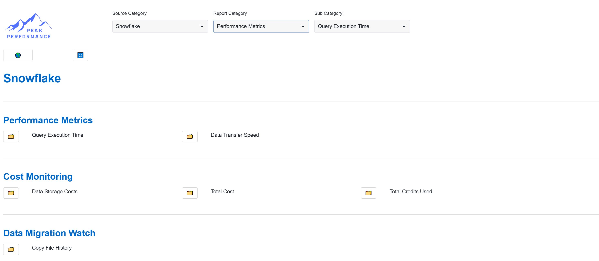

Please Note: Snowflake Application Owner Privilages apply to queries executed on Account_Usage and Organization_Usage Schema's in Snowflake Shared database

#### Alation Consumption Tracker:
- [Back](#Table-of-Contents) 
	
With Peak Performance, you can instantly gain visibility across all connected data sources and databases within your enterprise. 
You can instantly gain access to the migration path, progress, trusted data
You can instantly monitor cost, consumption and usage history
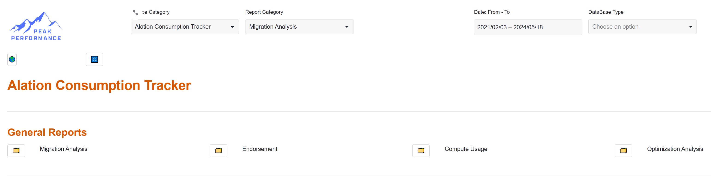

#### Alation Analytics: 
- [Back](#Table-of-Contents)

With Peak Performance, you can instantly gain analytic visibility into connected data sources and databases within your enterprise. 
You can instantly gain access to the top contributors and adoption
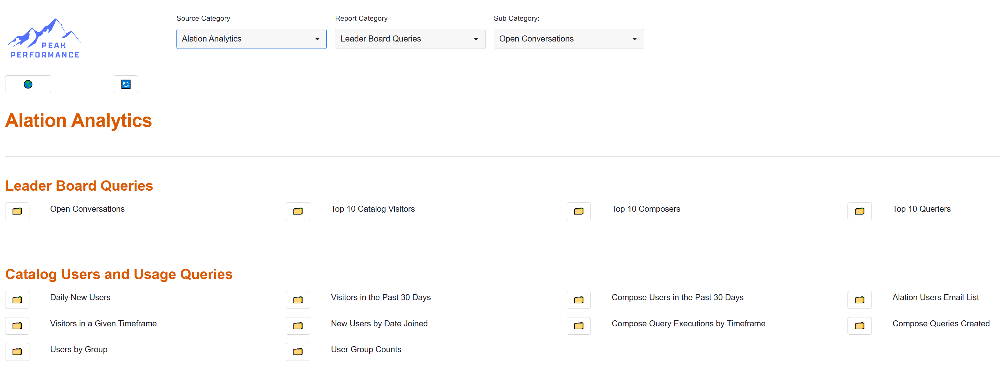
	
### Peak Performance Header Control
- [Back](#Table-of-Contents)
Description........................................
.........................................................
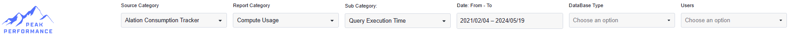

#### Source Category:
- [Back](#Table-of-Contents)
Description........................................
.........................................................
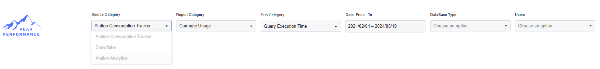

#### Report Category:
- [Back](#Table-of-Contents)
Description........................................
.........................................................
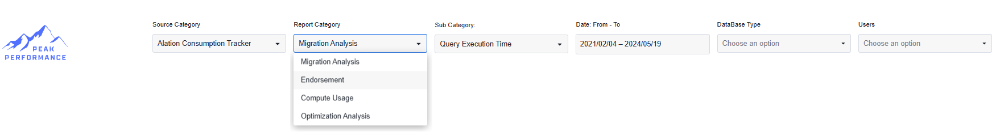

#### Sub Category:
- [Back](#Table-of-Contents)
Description........................................
.........................................................
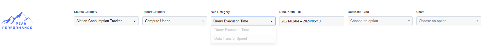

#### Date From - To:
- [Back](#Table-of-Contents)
Description........................................
.........................................................
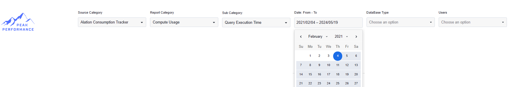

#### Database Type:
- [Back](#Table-of-Contents)
Description........................................
.........................................................
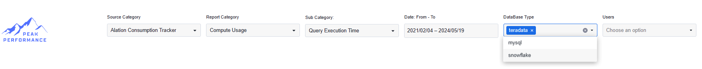

#### Users:
- [Back](#Table-of-Contents)
Description........................................
.........................................................
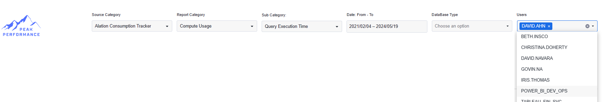

###  Testing the below

### This repository contains the sample code for the [Getting Started with Snowflake Native Apps Quicsktart](https://quickstarts.snowflake.com/guide/getting_started_with_native_apps/).


